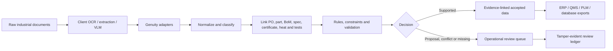

# Start here: Genuity 2.0 — Use Case 1

> **Current product position:** evidence infrastructure for trustworthy industrial AI. This use case converts existing extraction into evidence-linked engineering records and a fail-closed operational release decision. Read [DEMO.md](DEMO.md) before presenting it and [FOUNDERS.md](FOUNDERS.md) for the LTTS/founder direction.

## 1. What this folder is

This is a complete, self-contained proof and pilot kit for Genuity's first industrial-document reconciliation use case.

The problem is not OCR. Engineering-service companies already have OCR, extraction templates, VLM access, data engineers, and client-specific processes. The remaining expensive work is turning imperfect extraction into trustworthy operational data:

- uncertain or missing fields;
- broken or inconsistent tables;
- conflicting documents;
- cross-document entity relationships;
- unit and format normalization;
- validation against specifications;
- evidence and auditability;
- human exception handling;
- expensive full-page model routing.

Genuity sits after the client's existing extraction stack:



The commercial promise to test is:

> Keep your OCR and existing VLMs. Genuity converts their incomplete output into validated, connected records using deterministic logic, cross-document evidence, explicit uncertainty, selective model routing, and human review only where necessary.

## 2. What the supplied proof demonstrates

The generated 12-page industrial packet includes a purchase order, invoice, BoM, current and old specifications, material certificate, certificate of conformance, chemistry results, mechanical results, hardness table, duplicate scan, and final inspection report.

It visibly proves all ten required behaviors:

1. An OCR `O/0` part-number error is safely recovered against a configured registry.
2. A missing invoice part number is recovered through an exact PO and supplier join.
3. A missing PO total is deterministically calculated.
4. A same-heat boron value is proposed but not accepted as a certificate observation.
5. A hardness median is marked analytics-only.
6. PO quantity 45 and invoice quantity 44 remain an unresolved conflict.
7. Missing inspector signoff remains unresolved.
8. Most documents use no LLM or VLM.
9. One obscured crop can use the simulated crop-only model adapter.
10. Five processing/cost scenarios are compared.

Current bundled result:

- ten-behavior scorecard: PASS;
- 77 automatically accepted and evidence-backed fields;
- 100% evidence coverage for accepted fields;
- 28/28 controlled critical fields correctly accepted in the synthetic fixture;
- six visible exceptions, of which five are blocking human-review cases;
- 21/21 provenance and policy integrity controls;
- 6/6 executable failure injections;
- 51/51 focused tests;
- independent artifact, policy, SQLite, and semantic verification: PASS.

Synthetic performance proves the implementation behaves as designed. It does not prove accuracy on a client's documents. The included pilot protocol explains how to establish that separately.

## 3. Folder map

```text
Genuity2.0 usecase1/
├── README.md                    Short pointer to this guide
├── START_HERE.md                Complete orientation and operating directions
├── FILE_CATALOG.md              File-by-file reference
├── pyproject.toml               Standalone, dependency-free package definition
├── run_demo.cmd / .ps1          One-command demonstration
├── verify_everything.cmd / .ps1 Tests plus independent output verification
├── source/genuity_reconcile/    Production-oriented Python implementation
├── tests/                       51 focused standard-library tests
├── domain_packs/                Client-configurable industrial policy pack
├── templates/                   Pilot, truth-set, and review templates
├── demo_output/                 Complete pre-generated and verified result
├── docs/                        Business, pilot, technical, licensing, and original brief
├── release/                     Standalone wheel and its SHA-256 checksum
└── build/                       Disposable wheel-build staging generated by packaging
```

`source/genuity_reconcile_usecase1.egg-info/`, `build/`, Python `__pycache__/`, and `demo_output/.genuity_cache/` are generated metadata/runtime directories. They are not authoritative source or business output and may be recreated.

For every individual file, see [FILE_CATALOG.md](FILE_CATALOG.md).

## 4. Fastest way to understand it

Read these in order:

1. This file.
2. [`demo_output/SUMMARY.md`](demo_output/SUMMARY.md) for the actual proof result.
3. [`demo_output/review_queue.json`](demo_output/review_queue.json) to see what is deliberately not trusted.
4. [`demo_output/canonical_records.json`](demo_output/canonical_records.json) for the connected operational record.
5. [`demo_output/graph.json`](demo_output/graph.json) for evidence-linked relationships.
6. [`docs/EXECUTIVE_BUSINESS_CASE.md`](docs/EXECUTIVE_BUSINESS_CASE.md) for the commercial decision case.
7. [`docs/MARKET_EVIDENCE_AND_PILOT.md`](docs/MARKET_EVIDENCE_AND_PILOT.md) for the falsifiable client pilot.
8. [`docs/TECHNICAL_GUIDE.md`](docs/TECHNICAL_GUIDE.md) for detailed commands.
9. [`demo_output/operational_release.json`](demo_output/operational_release.json) for the explicit no-write decision.

## 5. Run and verify on Windows

Requirements: Windows with Python 3.10 or newer available as `py -3`. The use-case package itself uses only the Python standard library.

### Option A — no installation

From this folder, double-click or execute:

```text
run_demo.cmd
verify_everything.cmd
```

PowerShell equivalents:

```powershell
.\run_demo.ps1
.\verify_everything.ps1
```

`run_demo` explicitly opts into regenerating `demo_output`. Real `run` and `batch` commands reject overlapping or non-empty output directories. `verify_everything` runs all 51 focused tests and independently verifies the exported artifacts.

### Option B — install the standalone package

```powershell
py -3 -m pip install .
genuity-reconcile demo --output-dir demo_output
genuity-reconcile verify --output-dir demo_output
```

### Expected result

The demo command should report `Ten-behaviour scorecard: PASS`. Verification should report:

- `status: PASS`;
- no missing or mismatched artifacts;
- safe manifest paths;
- matching semantic fingerprint;
- matching domain-pack hash;
- provenance integrity PASS;
- SQLite integrity `ok`;
- matching JSON/SQLite row counts;
- resilience status PASS.

## 6. Process real existing-OCR output

One run represents one connected procurement chain. Put one JSON file per source document in an input folder.

After installation:

```powershell
genuity-reconcile run `
  --ocr-dir C:\client\packet_001\ocr `
  --output-dir C:\client\packet_001\genuity_output `
  --domain-pack domain_packs\industrial_material_packet.json `
  --cache-dir C:\client\cache\packet_001
```

Without installation:

```powershell
$env:PYTHONPATH = "$PWD\source"
py -3 -m genuity_reconcile run --ocr-dir <folder> --output-dir <folder> --domain-pack domain_packs\industrial_material_packet.json
```

Do not mix unrelated PO chains in one run. The pipeline rejects multiple PO numbers rather than risk cross-record conflicts.

## 7. OCR input contract

Each input JSON represents one document:

```json
{
  "adapter": "client_ocr_adapter_name",
  "page_count": 1,
  "text": "PURCHASE ORDER ...",
  "fields": [
    {
      "name": "po_number",
      "value": "PO-1001",
      "unit": null,
      "confidence": 0.99,
      "page": 1,
      "region": "header",
      "bbox": [0.08, 0.08, 0.92, 0.16]
    }
  ]
}
```

Required document keys are `page_count`, `text`, and `fields`. Required field keys are `name`, `value`, `confidence`, `page`, and `region`. `unit` and normalized `bbox` are optional. The machine-readable contract is [`demo_output/ocr_input.schema.json`](demo_output/ocr_input.schema.json).

Input validation fails closed for malformed confidence, invalid pages, non-finite numbers, invalid bounding boxes, duplicate field names, vendor aliases that collapse to the same canonical field, and filenames that collapse to the same document ID.

## 8. Process many connected chains safely

Create one subfolder per chain:

```text
client_packets/
├── packet_0001/*.json
├── packet_0002/*.json
└── packet_0003/*.json
```

Then run:

```powershell
genuity-reconcile batch --ocr-root client_packets --output-root client_results --domain-pack domain_packs\industrial_material_packet.json
```

Each packet is independently reconciled, exported, and verified. `batch_summary.json` aggregates pages, fields, accepted values, review cases, unresolved values, model usage, cost, and semantic fingerprints without mixing entity scope.

The bundled 1,000-document benchmark is a local, single-process smoke test—not a production capacity claim. It checks deterministic throughput and duplicate reuse. Use the isolated batch command and deployment telemetry for actual capacity planning.

## 9. Decision and safety vocabulary

| Status/acceptance | Meaning | Operational use |
|---|---|---|
| `OBSERVED` + `ACCEPTED` | Directly extracted and supported by evidence | Allowed |
| `RECOVERED_*` + `ACCEPTED` | Deterministically corrected or retrieved under configured policy | Allowed |
| `DERIVED_DETERMINISTIC` + `ACCEPTED` | Calculated from evidenced inputs using a permitted method | Allowed |
| `PROPOSED_*` + `REVIEW` | Plausible candidate lacking authority for automatic acceptance | Blocked |
| `CONFLICT` + `REVIEW` | Sources disagree; authority order is shown but not silently applied | Blocked |
| `AMBIGUOUS_LINK` + `REVIEW` | More than one relationship is equally supported | Blocked |
| `ANALYTICS_ONLY` | Statistical value usable only for aggregate analysis | Never certified/operational |
| `MISSING` / exported `UNRESOLVED` | No defensible value exists | Remains blank |
| `UNCLASSIFIED_SOURCE` | Document type is unknown or classification is tied | Quarantined |

Every accepted field must have evidence. Every nonaccepted field appears exactly once in the exception queue.

## 10. Domain-pack configuration

[`domain_packs/industrial_material_packet.json`](domain_packs/industrial_material_packet.json) contains the client/domain policy:

- document types and deterministic classification cues;
- field aliases and required fields;
- critical fields;
- allowed part registry;
- join keys;
- source-authority order;
- material aliases and unit conversions;
- physical/domain bounds;
- permitted reconstruction methods;
- permitted imputation purposes;
- review threshold and human-cost assumptions;
- dated OCR/model pricing and tokenization assumptions.

The runtime validates this configuration before processing. The exact pack used for a run is exported as `domain_pack_snapshot.json` and cryptographically bound into `run_manifest.json` by a canonical SHA-256 hash.

Client quality owners—not the software alone—must approve source authority, criticality, accepted reconstruction methods, and operational acceptance policy.

## 11. Review workflow

Open `demo_output/review_queue.json`. Each exception includes:

- candidate and original extraction;
- status and reason code;
- source evidence IDs;
- rule results and rejected alternatives;
- suggested owner;
- priority and SLA;
- blocking state;
- stable deduplication key;
- required reviewer action.

Copy [`templates/REVIEW_RESOLUTION_TEMPLATE.csv`](templates/REVIEW_RESOLUTION_TEMPLATE.csv), replace the example, and create a review ledger:

```powershell
genuity-reconcile review-ledger --review-queue demo_output\review_queue.json --resolutions-csv review_resolutions.csv --output review_ledger.json
genuity-reconcile verify-review-ledger --ledger review_ledger.json --review-queue demo_output\review_queue.json
```

The ledger is hash chained and detects uncoordinated edits. It does not authenticate reviewer identity without an external signing/key system. It intentionally does not mutate canonical output; promotion to ERP/QMS/PLM must be a separate controlled integration step.

## 12. Accuracy evaluation with client truth

Start from [`templates/CLIENT_TRUTH_TEMPLATE.csv`](templates/CLIENT_TRUTH_TEMPLATE.csv). Keep truth blind during configuration and use independently adjudicated critical fields.

```powershell
genuity-reconcile evaluate --decisions demo_output\field_decisions.json --truth-csv client_truth.csv --output client_evaluation.json
```

The evaluator reports critical-field precision, automatic coverage, abstention, incorrect auto-accepts, and gate recommendations. The recommended pilot uses at least 10,000 stratified pages and 1,000 independently reviewed critical fields.

## 13. Economics and ROI

Cost is a first-class output. The pipeline records pages, fields, cache hits, rules, model calls, tokens, review cases, accepted/verified fields, unresolved fields, and time.

The five comparison arms are:

1. OCR only;
2. OCR plus deterministic rules;
3. OCR plus reconciliation and validation;
4. full-page VLM planning baseline;
5. Genuity selective routing.

The Genuity comparison conservatively charges every inspected crop as a cold-cache call, even when the actual run reused cache. Human-review rates for the planning baselines are assumptions, not vendor benchmarks.

Editable ROI example:

```powershell
genuity-reconcile estimate --pages 1000000 --human-hourly-cost 25 --implementation-cost 100000
```

Never use the supplied synthetic economics as a customer quote. Replace page volume, review rates, review minutes, loaded labor cost, route rate, extraction cost, and implementation cost with observed pilot telemetry.

The billion-dollar figure in the executive document is explicitly a portfolio avoided-cost value pool—not Genuity revenue, valuation, or TAM.

## 14. Integrity model

`run_manifest.json` binds exported artifacts by SHA-256, the canonical semantic output by a reproducibility fingerprint, input documents by content hash, and the domain pack by canonical hash.

The verifier checks:

- path traversal in the manifest;
- missing and changed artifacts;
- semantic fingerprint;
- domain-pack identity;
- provenance/policy status;
- resilience status;
- SQLite structural integrity;
- database/JSON row-count consistency.

Hashes detect accidental or uncoordinated changes. They do not prove who signed an artifact because this bundle intentionally contains no private signing key. Add client-managed signing/key infrastructure when authenticity or non-repudiation is required.

The `.genuity_cache` directory is ephemeral and excluded from the artifact manifest. Each cache entry carries its own integrity hash and is validated before reuse.

## 15. What is real, simulated, and not yet production

Real in this bundle:

- deterministic adapter/reconciliation code;
- domain-pack policy enforcement;
- evidence and decision records;
- content cache and tamper detection;
- conflict and ambiguity handling;
- exports and SQLite handoff;
- batch isolation;
- evaluation, economics, review ledger, tests, and verification.

Simulated:

- the optional cropped-region VLM adapter returns the known fixture candidate while exercising real routing, metering, cache, and review semantics.

Required before production:

- a client-approved OCR adapter and optional model adapter;
- access control and tenant isolation;
- secrets and key management;
- external signing if authenticity is required;
- retention/deletion policy;
- observability, retry/dead-letter handling, and deployment orchestration;
- security, privacy, SBOM, vulnerability, and legal/license review;
- approved system-of-record write-back workflow;
- blind holdout results on client data.

No root license existed in the original workspace. Read [`docs/DEPENDENCY_AND_LICENSE_NOTES.md`](docs/DEPENDENCY_AND_LICENSE_NOTES.md) before any external distribution.

## 16. Pilot decision gates

Proceed to limited production only if held-out client data demonstrates:

- 100% resolvable evidence coverage for accepted fields;
- zero unsupported or incorrect critical-field automatic accepts;
- zero silent conflicts;
- 100% exception visibility;
- critical-field precision at or above the client's threshold, targeting at least 99.5%;
- at least 30% lower exception minutes per completed record;
- at least 30% lower all-in cost per verified field than current and full-page-VLM arms;
- external routing below 10%, unless a different tradeoff is explicitly approved.

Stop or redesign when a safety gate repeatedly fails, when measured savings disappear after operational costs, or when available identifiers cannot support safe entity isolation.

## 17. Troubleshooting

| Symptom | Likely cause | Action |
|---|---|---|
| `No existing-OCR JSON files found` | Wrong input folder | Point `--ocr-dir` at the folder containing JSON files |
| `multiple PO numbers found` | Unrelated chains were mixed | Put each chain in its own subfolder and use `batch` |
| `UNCLASSIFIED_SOURCE` | No unique classification winner | Add approved cues or review/quarantine the document |
| `aliases collapse multiple inputs` | Two vendor fields map to one canonical name | Fix the adapter mapping; do not choose first value |
| cache integrity failure | Cache content was altered/corrupted | Quarantine the cache entry and rerun the approved adapter |
| integrity gate rejected output | Provenance or policy invariant failed | Inspect `integrity_report.json`; do not export operationally |
| verifier reports hash mismatch | An artifact changed after manifest creation | Regenerate the run or investigate the change |
| fixture precision is not calculated | Input is real/non-fixture data | Use the blind-truth `evaluate` workflow |

## 18. Recommended handoff by role

- Executive/sales leader: this guide, `docs/EXECUTIVE_BUSINESS_CASE.md`, and `docs/MARKET_EVIDENCE_AND_PILOT.md`.
- Engineering lead: `docs/TECHNICAL_GUIDE.md`, `source/`, `tests/`, and `domain_packs/`.
- Quality/compliance owner: `review_queue.json`, `integrity_report.json`, `validation_report.json`, evidence and domain-pack snapshot.
- Data engineer: OCR schema, canonical CSV/JSON, SQLite database, normalized tables, and batch command.
- Pilot analyst: truth and scorecard templates, evaluator, metrics, cost report, and business sensitivity files.
- Legal/security: `docs/DEPENDENCY_AND_LICENSE_NOTES.md`, retention/signing boundaries, and vendor terms.

The correct next commercial step is the included paid blind pilot—not an unverified production or valuation claim.
